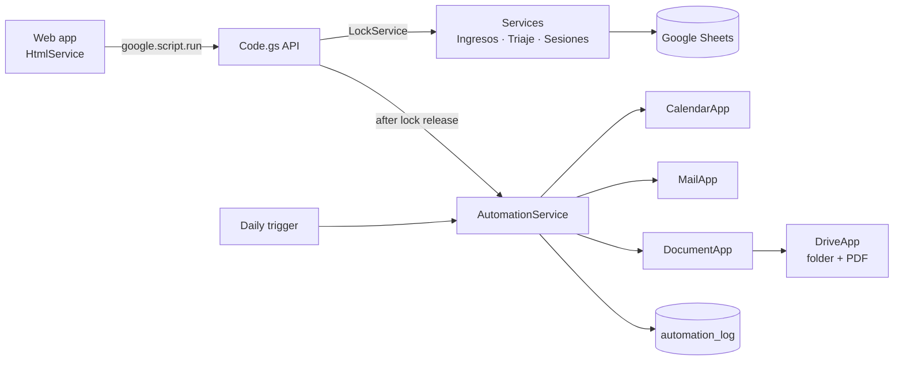

# Clinic case pipeline (Google Apps Script)

A case-management web app for a small multidisciplinary therapy center, built on Google Sheets and Apps Script. Staff register a person once, schedule them through triage, log each therapy session with a structured A-B-C behaviour matrix, and look up any case in a 360° view.

This repository is a **demo rebuild with synthetic data**. Every name, ID and value in it is invented, and the sheet names were made generic. No real records are included.

## What is original and what was added for the demo

The core system (intake, triage and agenda, specialty panel, session + A-B-C matrix, search, filters, 360° view, schema-driven forms, LockService write serialization) is a copy of a system I designed for a public social-services center in Ecuador.

The automation layer is **new in this demo**. The production system did not send email, create calendar events or generate documents. Files marked `[EXTENSIÓN DEMO]` are the additions:

| When this happens | The pipeline does this |
|---|---|
| An appointment is saved in triage | Creates a Google Calendar event with reminders, then emails a confirmation |
| A therapy session is saved | Builds a formatted Google Doc report, files it in a Drive folder, exports a PDF next to it, and emails the link with the PDF attached |
| Every morning (time-driven trigger) | Emails the day's agenda grouped by specialty |
| Any of the above | Writes a row to the `automation_log` sheet, shown in tab 6 of the app |



Two design choices worth pointing out. Automations run after the write lock is released, so a slow Calendar or Drive call never blocks another user's save. And each step is isolated: if Calendar fails, the appointment is still saved, the email still goes out, and the failure is logged and shown in the UI.

## Safe by default

`AUTOMATION.DEMO_SAFE_MODE` is `true`, which sends every email to the account running the script, never to an address stored in a record. Emails carry no vital signs or clinical detail, only what the recipient needs. The web app deploys with `access: MYSELF`.

## A bug the rebuild fixed

Sheets auto-converts strings like `2026-10-07` or `09:30` into Date objects. The original data layer read those cells back unchanged, so the agenda's date comparison saw `Wed Oct 07` instead of `2026-10-07` and returned nothing, and `google.script.run` cannot send Date objects to the browser anyway. `Database.gs` now normalizes date, time and datetime cells back to strings, and `setupDatabase()` formats those columns as plain text. A test reproduces the conversion and checks the fix.

## Run it

You need a Google account and [clasp](https://github.com/google/clasp).

1. Create a new Google Sheet, then open **Extensions → Apps Script** and copy its script ID.
2. `cp .clasp.json.example .clasp.json` and paste the ID.
3. `npx @google/clasp login` and `npx @google/clasp push`.
4. In the Apps Script editor, run `setupDatabase`, then `seedDemoData` (approve the permissions).
5. Run `runDemoPipeline` to push one fictional case through every automation. Check your inbox, calendar and the `Demo — Informes de sesión` folder in Drive.
6. Optional: run `installTriggers` for the daily digest, and **Deploy → New deployment → Web app** for the UI.

Without clasp, you can paste each file from `src/` into the editor by hand (HTML files without the extension).

## Tests

```
npm test
```

The tests load the real `.gs` files into Node with in-memory mocks of SpreadsheetApp, MailApp, CalendarApp, DocumentApp, DriveApp, LockService and ScriptApp, and run the full flow: validation, uniqueness, appointment to calendar to email, session to Doc to PDF to email, failure isolation, the daily digest and trigger installation. No Google account is needed.

The mocks only check that the code calls these services correctly. They don't prove it behaves the same on Google's servers, so run `runDemoPipeline` in a real project before relying on it.

## Layout

```
src/
  Config.gs               schemas, catalogs, logical table/field names
  AutomationConfig.gs     [demo] automation settings
  Database.gs             generic Sheets data layer
  Validation.gs           schema validation
  IngresosService.gs      intake
  TriajeService.gs        triage + scheduling
  AgendaService.gs        agenda by specialty
  SesionesService.gs      sessions + A-B-C events
  SearchService.gs        search, filters, 360° view
  NotificationService.gs  [demo] email
  CalendarService.gs      [demo] calendar events
  ReportService.gs        [demo] Docs report + Drive + PDF
  AutomationService.gs    [demo] orchestration, log, triggers
  DemoData.gs             synthetic data, one-click pipeline run
  Code.gs                 web app entry point + API
  Index/Stylesheet/JavaScript.html   front end
test/                     Node test harness and mocks
```

## Limits

Sheets is not a database. Uniqueness and foreign keys are enforced in code, writes are serialized per script, and nothing is transactional. That is fine for a center with a handful of staff and a few hundred cases. Past a few thousand cases or a few dozen concurrent users, move the data to a real database.
